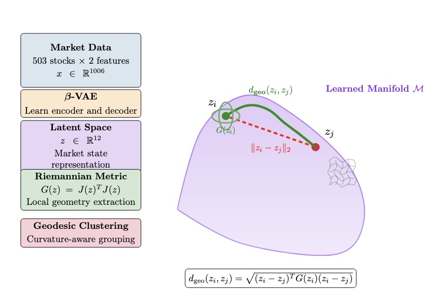

# Market Latent Geometry

**Learning and analyzing the geometric structure of financial market manifolds using β-VAE and Riemannian geometry.**

<p align="center">
  
</p>

This repository implements a framework for discovering the intrinsic geometry of financial time series through variational autoencoders. By treating the VAE decoder as a parameterization of an embedded manifold, we compute Riemannian metric tensors and geodesic distances that respect the learned curvature of market states.

## Quick Start

### 1. Setup Environment

```bash
# Create virtual environment
python3 -m venv geometry
source geometry/bin/activate  # On Windows: geometry\Scripts\activate

# Install dependencies
pip install -r requirements.txt
```

### 2. Run the Complete Pipeline

```bash
cd src/

# Step 1: Train the β-VAE with specialized loss
python train_vae.py

# Step 2: Evaluate latent space quality 
python evaluate_vae.py ../results/vae_training_YYYYMMDD_HHMMSS

# Step 3: Analyze manifold geometry and clustering
python analyze_latent_geometry.py ../results/vae_training_YYYYMMDD_HHMMSS
```

## Pipeline Overview

### 1. Train β-VAE (`train_vae.py`)
Train a β-Variational Autoencoder with specialized loss components for financial time series stability:
- Posterior collapse prevention through KL capacity scheduling
- Orthogonality regularization for disentangled latent factors
- Robust training pipeline for financial data

### 2. Evaluate Model (`evaluate_vae.py`) 
Validate latent space quality and training convergence:
- Latent space orthogonality analysis
- Distribution normality checks
- Training curve diagnostics

### 3. Analyze Geometry (`analyze_latent_geometry.py`)
Compute manifold geometry and perform curvature-aware clustering:
- Riemannian metric tensor computation via decoder Jacobians
- Geodesic distance calculation
- Clustering comparison (Euclidean vs Geodesic vs PCA)
- 3D visualizations of learned manifold structure

## Directory Structure

```
market-latent-geometry/
├── src/
│   ├── train_vae.py              # β-VAE training with specialized loss
│   ├── evaluate_vae.py           # Latent space validation  
│   ├── analyze_latent_geometry.py # Geometric analysis and clustering
│   ├── model.py                  # β-VAE architecture definition
│   └── config.py                 # Hyperparameter configuration
├── processed_data_simple/
│   └── latest/                   # Preprocessed S&P 500 market data
├── results/
│   └── vae_training_*/           # Training results (timestamped)
│       ├── evaluation/           # Latent space validation
│       └── geometry_analysis/    # Geometric analysis outputs
└── requirements.txt
```

## Configuration

Core hyperparameters in `src/config.py`:

```python
# β-VAE Architecture  
LATENT_DIM = 12        # Latent manifold dimension
HIDDEN_DIM = 128       # Hidden layer size
INPUT_DIM = 1006       # Market data dimension (503 stocks × 2 features)

# Specialized Loss Components
BETA = 1.0             # KL divergence weight 
C_CAPACITY = 4.0       # KL capacity target
LAMBDA_ORTHO = 1e-4    # Orthogonality penalty weight

# Training Parameters
LEARNING_RATE = 1e-3   # Adam learning rate
BATCH_SIZE = 32        # Batch size
NUM_EPOCHS = 80        # Maximum epochs  
PATIENCE = 200         # Early stopping patience
```

## Research Workflow

1. **Train β-VAE**: Learn stable latent manifold representation
2. **Validate Latents**: Ensure orthogonality and normality  
3. **Geometric Analysis**: Compute manifold metrics and validate clustering
4. **Explore Results**: Review interactive visualizations

## Key Research Findings

### Manifold Geometry Discovery
- **Curvature Evidence**: Non-linear relationship between geodesic and Euclidean distances
- **Metric Tensor Computation**: Local geometry captured via decoder Jacobians  
- **Riemannian Structure**: Meaningful geometric structure in learned latent space

### Clustering Performance
- **Geodesic Advantage**: Improved Silhouette scores (0.07 → 0.48)
- **Calinski-Harabasz**: Better cluster separation (64 → 1,817)  
- **Davies-Bouldin**: Reduced cluster overlap (2.57 → 0.60)
- **Temporal Coherence**: Geodesic clusters show better chronological ordering

### Technical Contributions
- **Stable Training**: Overcomes posterior collapse in financial VAEs
- **Orthogonal Latents**: Decorrelated factors via specialized loss design
- **Geometric Pipeline**: End-to-end framework for manifold learning on time series

## Dependencies

Core requirements:
- `torch` - PyTorch for β-VAE implementation
- `numpy`, `pandas` - Data manipulation and linear algebra
- `matplotlib`, `seaborn` - Statistical plotting and analysis
- `scikit-learn` - Clustering algorithms and manifold learning
- `scipy` - Riemannian geometry computations

Optional:
- `plotly` - Interactive 3D visualizations

## Usage Notes

- Use default parameters for initial runs
- Use `--n_samples 500` for faster analysis on large datasets  
- Adjust `--n_clusters` based on desired granularity
- Install plotly for interactive 3D manifold exploration
- Each run creates timestamped results for comparison

## Paper Reference

This implementation supports the research described in:

**"Market Manifolds: β-VAE Learning and Geometry on Time Series"**

*Abstract*: Financial markets exhibit complex, non-linear dynamics that traditional Euclidean models often fail to capture. This paper introduces a novel framework for learning and analyzing the underlying geometry of financial market states using β-VAEs with Riemannian metric computation.

## Future Research Directions

- **Generative Modeling**: Sample realistic market scenarios along geodesic paths
- **Reinforcement Learning**: Train agents directly on the learned manifold  
- **Risk Management**: Use curvature as an early warning signal for instability
- **Multi-Asset**: Extend framework to FX, commodities, and crypto markets

---

*This framework establishes a foundation for geometry-aware analysis of financial time series through learned manifold representations.*