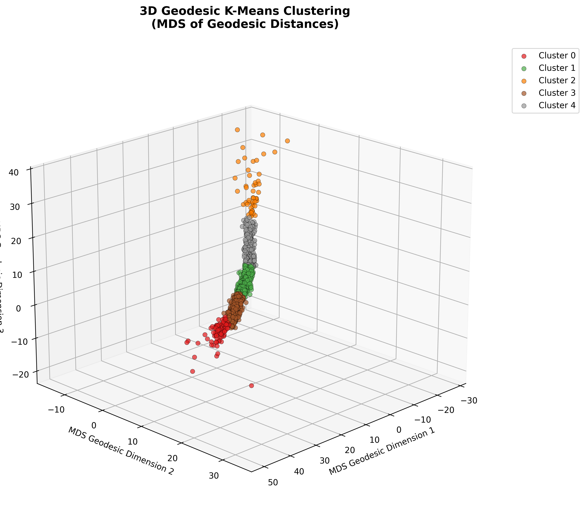
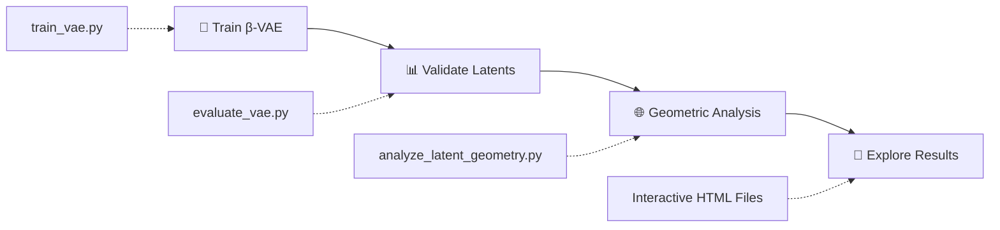

# Market Latent Geometry

<div align="center">


**Learning and analyzing the geometric structure of financial market manifolds using β-VAE and Riemannian geometry.**

</div>

---

This repository implements a novel framework for discovering the intrinsic geometry of financial time series through variational autoencoders. By treating the VAE decoder as a parameterization of an embedded manifold, we compute Riemannian metric tensors and geodesic distances that respect the learned curvature of market states.

<div align="center">



*Figure: 3D visualization of geodesic K-means clustering on the learned market manifold. Each color represents a distinct cluster discovered through curvature-aware distances, revealing the intrinsic geometric structure of financial market states.*

</div>

## 📑 Table of Contents

- [🚀 Quick Start](#-quick-start)
- [📋 Pipeline Overview](#-pipeline-overview)
- [📁 Directory Structure](#-directory-structure)
- [⚙️ Configuration](#️-configuration)
- [🎯 Research Workflow](#-research-workflow)
- [📊 Key Research Findings](#-key-research-findings)
- [📖 Paper Reference](#-paper-reference)
- [🔬 Future Research Directions](#-future-research-directions)

## 🚀 Quick Start

### 1. Setup Environment

```bash
# Create virtual environment
python3 -m venv geometry
source geometry/bin/activate  # On Windows: geometry\Scripts\activate

# Install dependencies
pip install -r requirements.txt
```

### 2. Run the Complete Pipeline

```bash
cd src/

# Step 1: Train the β-VAE with specialized loss
python train_vae.py

# Step 2: Evaluate latent space quality 
python evaluate_vae.py ../results/vae_training_YYYYMMDD_HHMMSS

# Step 3: Analyze manifold geometry and clustering
python analyze_latent_geometry.py ../results/vae_training_YYYYMMDD_HHMMSS
```

## 📋 Pipeline Overview

<table>
<tr>
<td width="33%">

### 🧠 **Stage 1: Training**
#### `train_vae.py`

Train a β-VAE with specialized loss components designed for financial time series stability.

**✨ Key Features:**
- 🔧 Posterior collapse prevention
- 📈 KL capacity scheduling  
- 🎯 Orthogonality regularization
- 📊 Robust loss formulation

```bash
python train_vae.py
```

**📁 Outputs:**
- Model weights & architecture
- Latent representations
- Training diagnostics
- Configuration logs

</td>
<td width="33%">

### 📊 **Stage 2: Validation**
#### `evaluate_vae.py`

Validate the learned latent space quality and assess training convergence.

**🔍 Analysis:**
- 🔗 Latent orthogonality
- 📈 Distribution normality
- 📉 Training convergence
- ✅ VAE assumptions

```bash
python evaluate_vae.py <results_path>
```

**📁 Outputs:**
- Correlation analysis
- Distribution comparisons
- Training curves
- Statistical reports

</td>
<td width="33%">

### 🌐 **Stage 3: Geometry**
#### `analyze_latent_geometry.py`

Compute manifold geometry and perform curvature-aware clustering analysis.

**🎯 Core Analysis:**
- 📐 Riemannian metric tensors
- 📏 Geodesic distance computation
- 🔍 Clustering comparison
- 🎨 3D visualizations

```bash
python analyze_latent_geometry.py <results_path>
```

**📁 Outputs:**
- Geometric analysis data
- Clustering comparisons
- Interactive 3D plots
- Statistical validation

</td>
</tr>
</table>

---

### 🎯 **Key Analysis Outputs**

<details>
<summary><b>🔬 Geometric Analysis Results</b></summary>

- **`jacobians.npy`** - Decoder Jacobian matrices ∂g(z)/∂z
- **`riemannian_metrics.npy`** - Metric tensors G(z) = J^T J  
- **`geodesic_distances.npy`** - Curvature-aware distance matrices
- **`geodesic_vs_euclidean.png`** - Evidence of manifold curvature

</details>

<details>
<summary><b>📊 Clustering Validation</b></summary>

- **`clustering_comparison.png`** - Statistical comparison across methods
- **`clustering_comparison.json`** - Silhouette, Calinski-Harabasz, Davies-Bouldin scores
- **`2d_cluster_boundaries_comparison.png`** - Decision surface visualization
- **Cluster labels** - Euclidean vs geodesic assignments

</details>

<details>
<summary><b>🎨 Interactive 3D Visualizations</b> (requires plotly)</summary>

- **`3d_latent_flow.html`** - Time-colored trajectory through latent manifold
- **`3d_clustering_comparison.html`** - Euclidean vs geodesic clustering comparison  
- **`3d_curvature_map.html`** - Local curvature visualization
- **`3d_jacobian_norm_map.html`** - Jacobian norm distribution

</details>

## 📁 Directory Structure

```
market-latent-geometry/
├── src/
│   ├── train_vae.py              # β-VAE training with specialized loss
│   ├── evaluate_vae.py           # Latent space validation  
│   ├── analyze_latent_geometry.py # Geometric analysis and clustering
│   ├── model.py                  # β-VAE architecture definition
│   └── config.py                 # Hyperparameter configuration
├── processed_data_simple/
│   └── latest/                   # Preprocessed S&P 500 market data
├── results/
│   └── vae_training_*/           # Training results (timestamped)
│       ├── evaluation/           # Latent space validation
│       └── geometry_analysis/    # Geometric analysis outputs
└── requirements.txt
```

## ⚙️ Configuration

Core hyperparameters in `src/config.py`:

```python
# β-VAE Architecture  
LATENT_DIM = 12        # Latent manifold dimension
HIDDEN_DIM = 128       # Hidden layer size
INPUT_DIM = 1006       # Market data dimension (503 stocks × 2 features)

# Specialized Loss Components
BETA = 1.0             # KL divergence weight 
C_CAPACITY = 4.0       # KL capacity target
LAMBDA_ORTHO = 1e-4    # Orthogonality penalty weight

# Training Parameters
LEARNING_RATE = 1e-3   # Adam learning rate
BATCH_SIZE = 32        # Batch size
NUM_EPOCHS = 80        # Maximum epochs  
PATIENCE = 200         # Early stopping patience
```

## 🎯 Research Workflow



| Step | Script | Purpose | Key Output |
|------|--------|---------|------------|
| 1️⃣ | `train_vae.py` | Learn stable latent manifold representation | Model weights & latent codes |
| 2️⃣ | `evaluate_vae.py` | Ensure orthogonality and normality | Validation reports & diagnostics |
| 3️⃣ | `analyze_latent_geometry.py` | Compute manifold metrics and clustering | Geometric analysis & 3D plots |
| 4️⃣ | *Exploration* | Review clustering comparisons | Interactive visualizations |

## 📊 Key Research Findings

<div align="center">

### 🎯 **Core Discoveries**

</div>

<table>
<tr>
<td width="33%">

#### 🌐 **Manifold Geometry**
- **🔄 Curvature Evidence**: Non-linear relationship between geodesic and Euclidean distances
- **📐 Metric Tensors**: Local geometry captured via decoder Jacobians  
- **🗺️ Riemannian Structure**: Meaningful geometric structure in learned latent space

</td>
<td width="33%">

#### 📈 **Clustering Performance**
- **🎯 Geodesic Advantage**: Silhouette scores `0.07 → 0.48`
- **📊 Calinski-Harabasz**: Better separation `64 → 1,817`  
- **🔍 Davies-Bouldin**: Reduced overlap `2.57 → 0.60`
- **⏰ Temporal Coherence**: Better chronological ordering

</td>
<td width="33%">

#### 🔧 **Technical Contributions**
- **🛡️ Stable Training**: Overcomes posterior collapse in financial VAEs
- **🎯 Orthogonal Latents**: Decorrelated factors via specialized loss
- **⚙️ Geometric Pipeline**: End-to-end manifold learning framework

</td>
</tr>
</table>

---

> **💡 Key Insight**: *Geodesic distances that respect learned manifold curvature significantly outperform Euclidean distances for clustering financial market states, providing evidence for intrinsic geometric structure in market dynamics.*

## 🛠️ Dependencies

**Core Requirements**:
- `torch` - PyTorch for β-VAE implementation
- `numpy`, `pandas` - Data manipulation and linear algebra
- `matplotlib`, `seaborn` - Statistical plotting and analysis
- `scikit-learn` - Clustering algorithms and manifold learning
- `scipy` - Riemannian geometry computations

**Optional (for interactive 3D visualizations)**:
- `plotly` - Interactive manifold exploration

```bash
pip install plotly  # Recommended for full experience
```

## 💡 Usage Tips

- **First Run**: Use default parameters to familiarize with geometric outputs
- **Performance**: Use `--n_samples 500` for faster analysis on large datasets  
- **Clustering**: Adjust `--n_clusters` based on desired granularity
- **Visualization**: Install plotly for interactive 3D manifold exploration
- **Reproducibility**: Each run gets timestamped results for comparison

## 📖 Paper Reference

This implementation supports the research described in:

**"Market Manifolds: β-VAE Learning and Geometry on Time Series"**

*Abstract*: Financial markets exhibit complex, non-linear dynamics that traditional Euclidean models often fail to capture. This paper introduces a novel framework for learning and analyzing the underlying geometry of financial market states using β-VAEs with Riemannian metric computation.

## 🔬 Future Research Directions

- **Generative Modeling**: Sample realistic market scenarios along geodesic paths
- **Reinforcement Learning**: Train agents directly on the learned manifold  
- **Risk Management**: Use curvature as an early warning signal for instability
- **Multi-Asset**: Extend framework to FX, commodities, and crypto markets

---

<div align="center">

### 🌟 **Impact & Innovation**

*This framework establishes a new foundation for geometry-aware quantitative finance through learned manifold representations.*

[](https://github.com/username/market-latent-geometry)
[](https://arxiv.org/abs/2024.XXXXX)

**🎯 Core Innovation**: *Proving that financial markets have intrinsic geometric structure discoverable through VAE manifold learning*

**🔬 Research Impact**: *First end-to-end pipeline for Riemannian geometry analysis of financial time series*

**⚡ Practical Applications**: *Geodesic-aware clustering, generative modeling, and reinforcement learning on market manifolds*

---

<sub>Built with ❤️ for the intersection of differential geometry and quantitative finance</sub>

</div>